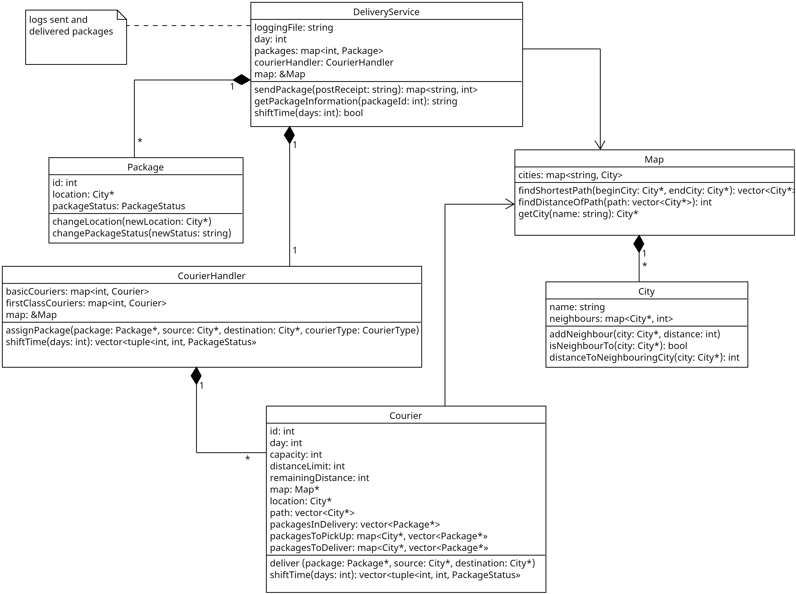

# Delivery Service

Below is a documentation for a simple simulation of a delivery service.

A customer can send a package either via basic or first class courier upon which the price aof the delivery will be calculated. The package is assigned to a courier which will then pick it up and deliver it. The courier takes the shortest possible path to pick the package up and deliver it. Simulation of time is achieved through a method in `DeliveryService`. Lastly, customer can ask for a package status and every package change is logged into logging text file.

Here is a simple diagram of the system:

## `DeliveryService`

Main component that controls how and where delivery requests are handled.

### Fields

- `const string loggingFile` - name of a file where the changes should be logged
- `int day` - day of the simulation
- `unordered_map<int, Package> packages` - vector of all packages created
- `CourierHandler courierHandler` - separate class mainly for handling package assignment to couriers
- `Map &map` - map of available cities

### Constructor

- `DeliveryService(const string &loggingFile, Map &map, int numberOfBasicCouriers, int numberOfFirstClassCouriers, const string &startingLocation, int distanceLimitBasicCourier = basicCourierStats.at("distanceLimit"), int distanceLimitFirstClassCourier = firstClassCourierStats.at("distanceLimit"))`
  - **parameters**
    - `const string &loggingFile` - name of the file where to log the changes
    - `Map &map` - reference to `Map` instance
    - `int numberOfBasicCouriers` - number of basic couriers to be created, passed to `CourierHandler` constructor
    - `int numberOfFirstClassCouriers` - number of first class couriers to be created, passed to `CourierHandler` constructor
    - `const string &startingLocation` - name of the city where all the couriers will start, passed to `CourierHandler` constructor
    - `int distanceLimitBasicCourier` - daily distance limit for a basic courier, default `150`
    - `int distanceLimitFirstClassCourier` - daily distance limit for a first class courier, default `400`

### Methods

- `unordered_map<string, int> sendPackage(const string &postReceipt)` - method for sending a package
  - **parameters**
    - `const string &postReceipt` - string formatted as `"nameOfTheSourceCity,nameOfTheDestinationCity,weightOfThePackage,wantedCourierType"`, creates the package according to given information
  - **returns**
    - `unordered_map<string, int>` - `"ID"`, `"price"` with numeric values relevant for created package
- `string getPackageInformation(int packageId)` - method for getting package information based on its id
  - **parameters**
    - `int packageId` - ID of a package wanted
  - **returns**
    - `string` - structured string of package information
- `bool shiftDay(int days)` - method for time simulation, moves couriers, picks up/delivers packages, logs changes
  - **parameters**
    - `int days` - by how many days to shift
  - **returns**
    - `bool` - whether time shifting was successful (for example `False` for negative `days`)

## `Package`

Class that holds package information.

### Fields

- `const int id` - ID of the package
- `City location` - where the package currently is
- `PackageStatus packageStatus` - `enum`, status of the package, one of the: `NOT_PICKED_UP`, `IN_DELIVERY`, `DELIVERED`

### Constructor

- `Package(int id, City *location, PackageStatus packageStatus-NOT_PICKED_UP)`
  - **parameters**
    - `int id` - ID to be assigned to package
    - `City *location` - pointer to initial location of the package
    - `PackageStatus packageStatus` - initial status of the package, should be `NOT_PICKED_UP`

### Methods

- `void changeLocation(City *newLocation)` - changes field `location` to `newLocation`
- `void changePackageStatus(PackageStatus newStatus)` - changes field `packageStatus` to `newStatus`

## `Map`

A class that stores all cities and can find the shortest path between two cities.

### Fields

- `unordered_map<string, City> cities` - map of names of all cities paired with the instances of `City`

### Constructor

- `Map(const string &mapFile)` - constructs the map (`City` instances) from a given file
  - **parameters**
    - `const string &mapFile` - name of a properly structured text file, every line should look like `[cityName1] [cityName2] [distance]`, for each line it creates a path between those two cities with given length

### Methods

- `vector<City*> findShortestPath(City *beginCity, City *endCity)` - finds shortest possible path between `beginCity` and `endCity` through Dijkstra's algorithm, expects graph of cities to have only one component
  - **parameters**
    - `City *beginCity` - city from which we want to find the path
    - `City *endCity` - city in which the path needs to end
  - **returns**
    - `vector<City*>` - vector of cities on the shortest possible path between `beginCity` and `endCity` including both
- `int findDistanceOfPath(vector<City*> path)` - calculates distance of the path
  - **parameters**
    - `vector<City*> path` - path of cities to be calculated distance of
  - **returns**
    - `int` - distance of the path
    - `-1` - if two adjacent cities in the path are not neighbours

## `City`

A representation of a city which stores its neighbours and distances to them.

### Fields

- `string name` - name of the city
- `unordered_map<City*, int> neighbours` - map of all neighbouring cities and distances to them

### Constructor

- `City(const string &name)` - constructs a city instance with given name

### Methods

- `void addNeighbour(City *city, int distance)` - adds the city to map of neighbours (adds only one way neighbourhood)
  - **parameters**
    - `City *city` - city to be added as neighbour of the instance
    - `int distance` - distance to the new neighbouring city

- `bool isNeighbourTo(City *city)` - returns whether the current instance has the `city` as a neighbour
  - **parameters**
    - `City *city` - figure out whether the `city` is a neighbour to the current instance
  - **returns**
    - `bool` - `true` if `city` is in map of `neighbours`
- `int distanceToNeighbouringCity(City *city)` - returns the distance to the `city`
  - **parameters**
    - `City *city` - figure out the distance to `city` from current instance, only if they are neighbours
  - **returns**
    - `int` - distance of the current instance to the `city`
    - `-1` - if the `city` is not a neighbour of the current instance

## `CourierHandler`

A structure that handles actions related to couriers.

### Fields

- `unordered_map<int, Courier> basicCouriers` - map of all basic couriers stored by their ID
- `unordered_map<int, Courier> firstClassCouriers` - map of all first class couriers stored by their ID
- `Map &map` - reference to common `Map` instance

### Constructor

- `CourierHandler(int numberOfBasicCouriers, int numberOfFirstClassCouriers, const string &startingLocation, Map &map, int distanceLimitBasicCourier, int distanceLimitFirstClassCourier)` - creates required couriers
  - **parameters**
    - `const int &numberOfBasicCouriers` - number of `Courier` instances to be created and stored in `basicCouriers`
    - `const int &numberOfFirstClassCouriers` - number of `Courier` instances to be created and stored in `firstClassCouriers`
    - `const string &startingLocation` - name of starting city for all couriers
    - `Map &map` - reference to common `Map` of cities
    - `int distanceLimitBasicCourier` - daily distance limit for basic couriers
    - `int distanceLimitFirstClassCourier` - daily distance limit for first class couriers

### Methods

- `int assignPackage(Package *package, City *source, City *destination, CourierType courierType)` - assigns delivery of a given package to a courier
  - **parameters**
    - `Package *package` - pointer to a package to be delivered
    - `City *source` - where the package should be picked up
    - `City *destination` - where the package should be delivered to
    - `CourierType courierType` - enum (either `BASIC` or `FIRST_CLASS`), to which courier type should be package assigned to
  - **returns**
    - `int` - price for the distance part of the delivery, distance that the package will travel wit assigned courier times fee for distance according to courier type
- `vector<tuple<int, int, PackageStatus>> shiftTime(int days)` - moves couriers by their daily distance limit `days`-times
  - **parameters**
    - `int shift` - by how many days to shift
  - **returns**
    - `vector<tuple<int, int, PackageStatus>>` - vector of packages that changed status during the time shift, stored as tuples `(packageId, dayOfChange, newPackageStatus)`

## `Courier`

Courier representation that holds pointers to some packages, moves throughout the map and delivers packages.

### Fields

- `int id` - ID of the courier
- `int day` - representation of current day
- `const int distanceLimit` - how many kilometers can the courier travel in a day
- `int remaining distance` - how many kilometers the courier did not spend the day before (to simulate being "halfway" between the cities)
- `City *location` - current location of the courier
- `const Map *map` - pointer to common `Map` instance (for finding shortest paths)
- `vector<City*> path` - path of the cities that the courier will travel to, stored chronologically
- `vector<Package*> packagesInDelivery` - vector of pointer to `Package` instances that the courier currently delivers and needs to change their location
- `unordered_map<City*, vector<Package*>> packagesToPickUp` - hash-map of cities with vector of packages that the courier should pick up when he goes through that city
- `unordered_map<City*, vector<Package*>> packagesToDeliver` - hash-map of cities with vector of packages that the courier should drop off when he goes through that city

### Constructor

- `Courier(int id, City *startingLocation, const Map *map, int distanceLimit)` - sets all the corresponding fields of the courier to the given values

### Methods

- `void deliver(Package *package, City *source, City *destination)` - tells courier to deliver the package, essentially updates his path to take and adds the package to `packagesToPickUp` and `packagesToDeliver` based on `source` and `destination`
  - **parameters**
    - `Package *package` - package to be delivered
    - `City *source` - where the package needs to be picked up
    - `City *destination` - to where the package needs to be delivered
- `vector<tuple<int, int, PackageStatus>> shiftTime(int days)`- moves the courier by distance `distanceLimit` for each day, returns packages that changed status due to courier movement
  - **parameters**
    - `int days` - by how many days to shift
  - **returns**
    - `vector<tuple<int, int, PackageStatus>>` - vector of packages that changed status during the time shift, stored as tuples `(packageId, dayOfChange, newPackageStatus)`
